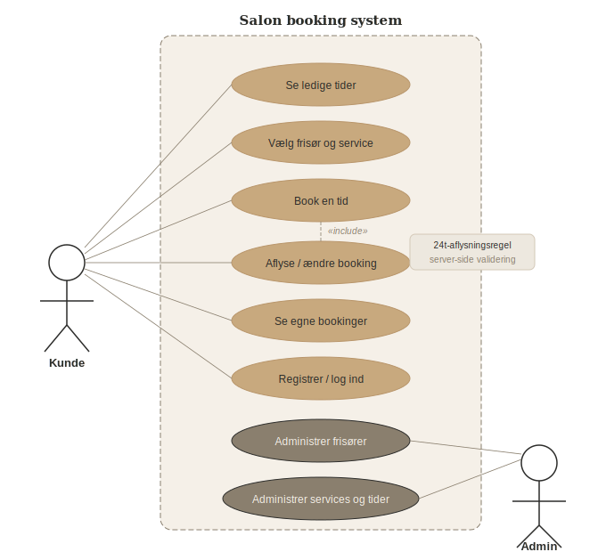

# Salon

Salon er et frisørbooking-system, der giver kunder mulighed for at se ledige tider, vælge frisør og service, og gennemføre bookinger online. Kunder kan aflyse eller ændre deres booking, men skal gøre det senest 24 timer før — ellers opkræves fuld pris. Administratorer kan administrere frisører, services, tider og bookinger via et beskyttet adminpanel. Systemet er bygget med Spring Boot, MySQL og Docker.

## Arkitektur

Projektet følger en klassisk lagdelt arkitektur med mikroserviceudvidelse:

### Hovedapplikation (Salon)

- **Controller** — modtager HTTP requests fra frontend og returnerer JSON via REST API
- **Service** — indeholder forretningslogikken, herunder 24-timers-reglen for aflysning
- **Repository** — kommunikerer med databasen via Spring Data JPA
- **Database** — MySQL database med 6 tabeller: Hairdresser, Service, Slot, Booking, Customer og Admin

### Mikroservice (pricing-service)

- Selvstændig Spring Boot applikation der håndterer prisberegning
- Kommunikerer med hovedapplikationen via REST ved hjælp af Spring RestClient
- Sikret med JWT (JSON Web Tokens)
- Kører på port 8081

`pricing-service` koden findes i mappen `pricing-service/` i samme repository.

## Sikkerhed

Applikationen bruger Spring Security med sessionsbaseret autentifikation via cookies.

**Roller:**

- `ROLE_ADMIN` — adgang til adminpanel og alle bookinger
- `ROLE_CUSTOMER` — adgang til booking og egne bookinger

**Endpoints:**

- Åbne: forsiden, services, ledige tider, login, registrering
- Beskyttede (kunde): `/api/bookings/**`
- Beskyttede (admin): `/api/admin/**`, `/api/services/**`, `/api/slots/**`

Passwords gemmes krypteret med BCrypt.

## 24-timers aflysningsregel

Kunder kan aflyse eller ændre deres booking gratis hvis det sker mere end 24 timer før timen. Aflyses eller ændres inden for 24 timer, opkræves fuld pris for behandlingen. Reglen valideres udelukkende server-side i `BookingService.isWithin24Hours()`.

## User Stories

| Story | Points |
|-------|--------|
| Som kunde vil jeg kunne se ledige tider og vælge frisør og service, så jeg nemt kan booke en tid online. | 3 |
| Som kunde vil jeg kunne aflyse min booking op til 24 timer før, så jeg bevarer fleksibilitet uden at salonen lider tab. | 2 |
| Som kunde vil jeg kunne se mine egne bookinger på min side, så jeg har overblik over kommende aftaler. | 2 |
| Som admin vil jeg kunne oprette og slette tider, frisører og services, så jeg har fuld kontrol over systemet. | 3 |
| Som admin vil jeg kunne se alle bookinger, så jeg kan planlægge arbejdsdagen. | 2 |
| Som kunde vil jeg kunne registrere mig og logge ind, så mine bookinger er tilknyttet min profil. | 2 |
| Som system skal prisberegningen ske via en separat mikroservice, så prissætningslogikken kan opdateres uafhængigt. | 5 |

## Use Case diagram



### Aktører

- **Kunde** — primær bruger der booker, aflyser og ser egne tider
- **Admin** — administrerer frisører, services og tider

### Use Cases

| Use Case | Aktør | Beskrivelse |
|----------|-------|-------------|
| Se ledige tider | Kunde | Viser alle ledige slots med frisør og service |
| Vælg frisør og service | Kunde | 3-trins booking-flow |
| Book en tid | Kunde | Opretter booking, kalder pricing-service |
| Aflyse / ændre booking | Kunde | Gratis hvis mere end 24 timer før |
| Se egne bookinger | Kunde | Oversigt på min side |
| Registrer / log ind | Kunde | Sessionsbaseret autentifikation |
| Administrer frisører | Admin | CRUD via adminpanel |
| Administrer services og tider | Admin | CRUD via adminpanel |


## Scrum-proces

Projektet er udviklet over 3 sprints med udgangspunkt i Scrum-frameworket.

| Sprint | Fokus | Leverede points |
|--------|-------|-----------------|
| Sprint 1 | Kernebooking — entiteter, repositories, booking-flow | 9 |
| Sprint 2 | Adminpanel — CRUD til frisører, services og tider | 7 |
| Sprint 3 | Sikkerhed og mikroservice — JWT, 24t-regel, CI/CD | 16 |
| Velocity | Gennemsnit | 10,7 points/sprint |

**Scrum-artefakter brugt i projektet:**

- **Product Backlog** — GitHub Issues med labels og story points
- **Sprint Backlog** — GitHub Projects Kanban board
- **Increment** — fungerende software leveret efter hvert sprint

## Branching-strategi

Projektet bruger en simpel trunk-based strategi:

- `main` — stabil produktionskode, beskyttet branch
- Feature branches navngives `feature/beskrivelse`
- Pull requests kræver at CI-pipeline er grøn før merge
- GitHub Actions kører automatisk tests på alle pull requests

## Metrikker

### Velocity

| Sprint | Planlagte points | Leverede points | Status |
|--------|-----------------|-----------------|--------|
| Sprint 1 — Kernebooking | 9 | 9 | 100% |
| Sprint 2 — Admin | 7 | 7 | 100% |
| Sprint 3 — Sikkerhed og mikroservice | 16 | 16 | 100% |
| Velocity (snit) | — | 10,7 points/sprint | Stabil |

### Code Coverage

| Komponent | Estimeret dækning | Bemærkning |
|-----------|-------------------|------------|
| BookingService | ~85% | isWithin24Hours() fuldt testet med Mockito |
| SlotService | ~70% | Happy path og edge cases dækket |
| PricingClient | ~60% | Mock af RestClient i unit tests |
| Controllers | ~40% | Integrationstests via H2 database |

### Lead time og Cycle time

| Metrik | Estimat | Mål |
|--------|---------|-----|
| Lead time (story til deploy) | 3-5 dage | Reduceres ved kortere sprints |
| Cycle time (code til merge) | under 1 dag | Holdes lav med små PR'er og hurtig CI |
| Deployment frequency | Per sprint | Ved hvert merge til main via GitHub Actions |
| Mean time to recovery (MTTR) | under 30 min | Docker rollback med forrige image |

### Leading vs. trailing metrikker

| Type | Eksempel fra projektet | Hvad den fortæller |
|------|----------------------|-------------------|
| Leading | Antal åbne pull requests | Signalerer kommende forsinkelse hvis mange er åbne |
| Leading | Test coverage øges | Indikerer at kvaliteten sandsynligvis forbedres |
| Trailing | Velocity per sprint | Viser hvad der faktisk er leveret — bagudskuende |
| Trailing | Antal aflyste bookinger | Viser om 24t-reglen virker i praksis |

## Sådan kører du projektet med Docker Compose

**Krav:** Docker og Docker Compose skal være installeret.

1. Klon repositoriet
2. Kopier eksempel-filerne og udfyld dine egne værdier:
   - `application-dev.properties.example` → `application-dev.properties`
   - `application-test.properties.example` → `application-test.properties`
3. Opret en `.env` fil i projektets rodmappe med dine egne værdier:

```
MYSQL_ROOT_PASSWORD=ditPassword
MYSQL_DATABASE=salon
SPRING_DATASOURCE_USERNAME=ditBrugernavn
SPRING_DATASOURCE_PASSWORD=ditPassword
JWT_SECRET=salon-super-secret-jwt-key-minimum-32-chars
```

4. Start applikationen:

```bash
docker compose up --build
```

Dette starter fire containers:

- `salon-db` — MySQL database
- `salon-pricing` — pricing mikroservice på port 8081
- `salon-app` — hovedapplikationen på port 8080
- `nginx` — reverse proxy på port 80/443

Åbn derefter browseren og gå til: `http://localhost:8080`

## Miljøvariabler (.env)

| Variabel | Beskrivelse |
|----------|-------------|
| `MYSQL_ROOT_PASSWORD` | MySQL root password |
| `MYSQL_DATABASE` | Databasenavn |
| `SPRING_DATASOURCE_USERNAME` | Database brugernavn |
| `SPRING_DATASOURCE_PASSWORD` | Database password |
| `JWT_SECRET` | JWT secret (skal være identisk i begge services) |

## JWT

JWT secret er konfigureret via miljøvariabel og skal være identisk i både hoved-app og pricing-service:

```
JWT_SECRET=salon-super-secret-jwt-key-minimum-32-chars
```

## Brugere

- **Admin:** Oprettes via `POST /api/admin` med brugernavn og password
- **Kunde:** Oprettes via registreringssiden på `/register.html`

Seed-data indeholder én admin med brugernavn `admin` og password `admin123`.

## Sådan kører du testene

Testene kan køres direkte i IntelliJ ved at højreklikke på test-mappen og vælge "Run All Tests".

Testene bruger Mockito til unit tests og H2 in-memory database til integrationstests — ingen MySQL forbindelse er nødvendig.

## CI/CD

Projektet har to GitHub Actions workflows:

- **CI** (`ci.yml`) — kører automatisk tests på alle pull requests mod main
- **Publish** (`publish.yml`) — bygger og pusher Docker image til GitHub Container Registry ved push til main

## Lokalt udviklingsmiljø

Kopier eksempel-filerne og udfyld dine egne værdier:

- `application-dev.properties.example` → `application-dev.properties`
- `application-test.properties.example` → `application-test.properties`

## Wireframes

### Forside


### Bookingside


### Adminpanel


### Login


### Min side


### Aflysningsmodal

