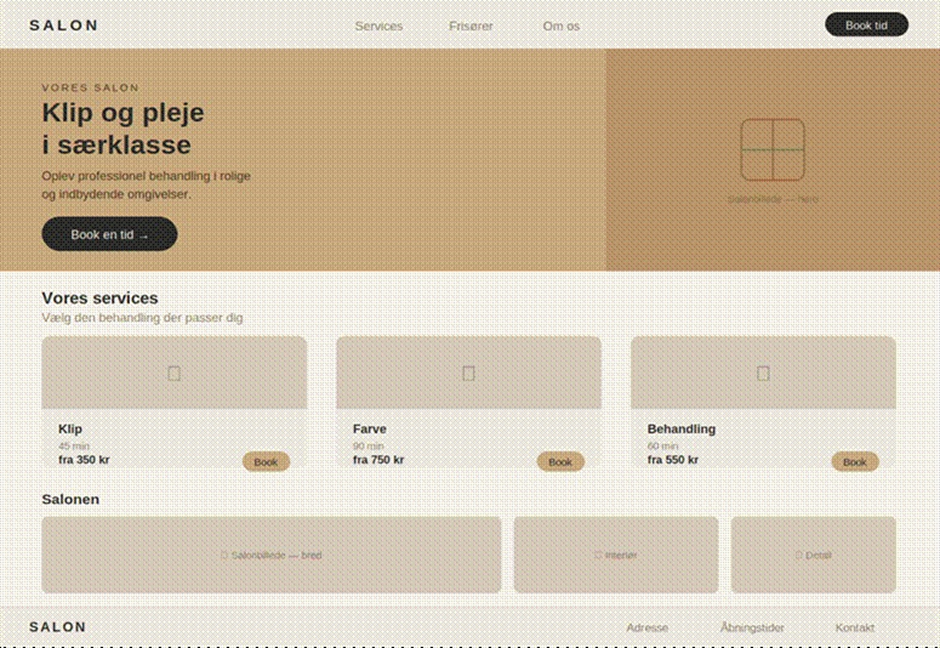
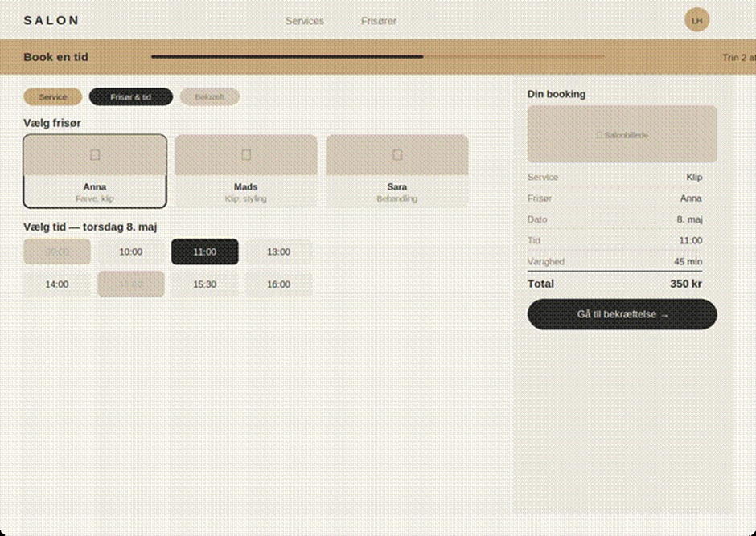
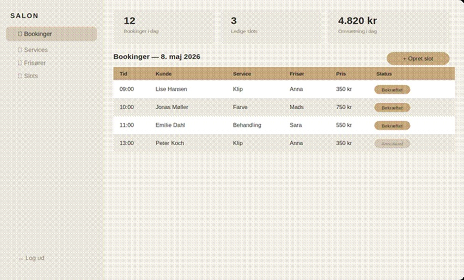
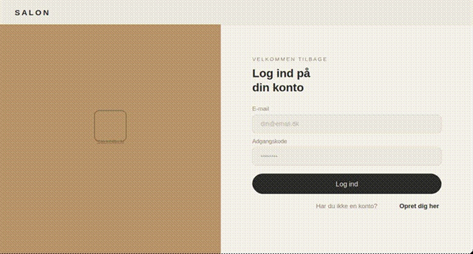
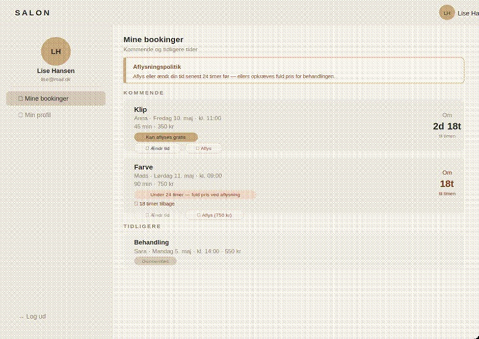
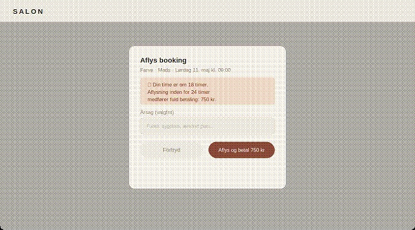

# Salon

Salon er et frisørbooking-system, der giver kunder mulighed for at se ledige tider, vælge frisør og service, og gennemføre bookinger online. Kunder kan aflyse eller ændre deres booking, men skal gøre det senest 24 timer før — ellers opkræves fuld pris. Administratorer kan administrere frisører, services, tider og bookinger via et beskyttet adminpanel. Systemet er bygget med Spring Boot, MySQL og Docker.

## Arkitektur

Projektet følger en klassisk lagdelt arkitektur med mikroserviceudvidelse:

### Hovedapplikation (Salon)

- **Controller** — modtager HTTP requests fra frontend og returnerer JSON via REST API
- **Service** — indeholder forretningslogikken, herunder 24-timers-reglen for aflysning
- **Repository** — kommunikerer med databasen via Spring Data JPA
- **Database** — MySQL database med 6 tabeller: Hairdresser, Service, Slot, Booking, Customer og Admin

### Mikroservice (pricing-service)

- Selvstændig Spring Boot applikation der håndterer prisberegning
- Kommunikerer med hovedapplikationen via REST ved hjælp af Spring RestClient
- Sikret med JWT (JSON Web Tokens)
- Kører på port 8081

`pricing-service` koden findes i mappen `pricing-service/` i samme repository.

## Sikkerhed

Applikationen bruger Spring Security med sessionsbaseret autentifikation via cookies.

**Roller:**
- `ROLE_ADMIN` — adgang til adminpanel og alle bookinger
- `ROLE_CUSTOMER` — adgang til booking og egne bookinger

**Endpoints:**
- Åbne: forsiden, services, ledige tider, login, registrering
- Beskyttede (kunde): `/api/bookings/**`
- Beskyttede (admin): `/api/admin/**`, `/api/services/**`, `/api/slots/**`

Passwords gemmes krypteret med BCrypt.

## 24-timers aflysningsregel

Kunder kan aflyse eller ændre deres booking gratis hvis det sker mere end 24 timer før timen. Aflyses eller ændres inden for 24 timer, opkræves fuld pris for behandlingen.

## Sådan kører du projektet med Docker Compose

**Krav:** Docker og Docker Compose skal være installeret.

1. Klon repositoriet
2. Opret en `.env` fil i projektets rodmappe med dine egne værdier:

```
MYSQL_ROOT_PASSWORD=ditPassword
MYSQL_DATABASE=salon
SPRING_DATASOURCE_USERNAME=ditBrugernavn
SPRING_DATASOURCE_PASSWORD=ditPassword
JWT_SECRET=salon-super-secret-jwt-key-minimum-32-chars
```

## Lokalt udviklingsmiljø
Kopier eksempel-filerne og udfyld dine egne værdier:
- `application-dev.properties.example` → `application-dev.properties`
- `application-test.properties.example` → `application-test.properties`

3. Start applikationen:

```bash
docker compose up --build
```

Dette starter fire containers:
- `salon-db` — MySQL database
- `salon-pricing` — pricing mikroservice på port 8081
- `salon-app` — hovedapplikationen på port 8080
- `nginx` — reverse proxy på port 80/443

Seed scriptet `seed.sql` køres automatisk af MySQL når databasen starter første gang.

Åbn derefter browseren og gå til: `http://localhost:8080`

## Miljøvariabler (.env)

| Variabel | Beskrivelse |
|----------|-------------|
| `MYSQL_ROOT_PASSWORD` | MySQL root password |
| `MYSQL_DATABASE` | Databasenavn |
| `SPRING_DATASOURCE_USERNAME` | Database brugernavn |
| `SPRING_DATASOURCE_PASSWORD` | Database password |
| `JWT_SECRET` | JWT secret (skal være identisk i begge services) |

## JWT

JWT secret er konfigureret via miljøvariabel og skal være identisk i både hoved-app og pricing-service:

```
JWT_SECRET=salon-super-secret-jwt-key-minimum-32-chars
```

## Brugere

- **Admin:** Oprettes via `POST /api/admin` med brugernavn og password
- **Kunde:** Oprettes via registreringssiden på `/register.html`

Seed-data indeholder én admin med brugernavn `admin` og password `admin123`.

## Sådan kører du testene

Testene kan køres direkte i IntelliJ ved at højreklikke på test-mappen og vælge "Run All Tests".

Testene bruger Mockito til unit tests og H2 in-memory database til integrationstests — ingen MySQL forbindelse er nødvendig.

## CI/CD

Projektet har en GitHub Actions pipeline der automatisk:
1. Kører alle tests
2. Bygger JAR-filen
3. Bygger og pusher Docker image til Docker Hub
4. Deployer til serveren via SSH

Pipeline konfigurationen findes i `.github/workflows/ci.yml`.

## Wireframes

### Forside


### Bookingside


### Adminpanel


### Login


### Min side


### Aflysningsmodal
